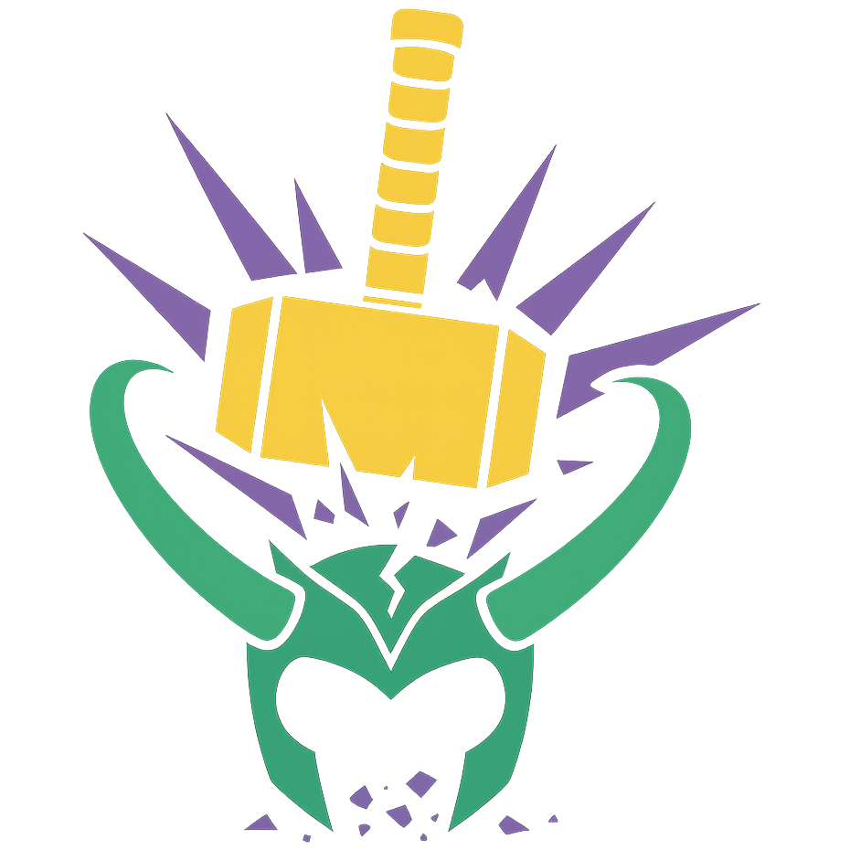

  
  <h1 align='center'>Thor Anticheat</h1>

Thor Anticheat is a tool designed with online gameshows in mind. In conjunction with other preventative measures for cheating, Thor helps make sure contestants aren't cheating.

## Getting started
Upon booting the program, you'll be greeted with a menu in which you will choose your hosting method. There are two choices: classic and tunnel
### Classic Mode
Classic mode will run the server on a port on your machine. This port can be customized on startup. This method assumes the user knows how to port forward and has done so accordingly, or has set up their own proxy.
### Tunnel Mode
Tunnel mode will use [localtunnel](https://github.com/localtunnel/localtunnel) to set up a reverse proxy to your server, granting a domain without any further intervention. The subdomain can be configured on startup. Due to security restrictions enforced by localtunnel, a tunnel password is required. Localtunnel automatically sets this password to be your public IPV4 address.
> [!NOTE]
> This means that technically, your server can have two passwords: the localtunnel password and the Thor Anticheat password. Keep this in mind

### Navigating the application
Once Thor Anticheat has been started, the main panel will appear.

The visible panels include
- The status of the server (online, offline, etc.) and its IP
- The main menu for configuration and actions
- The player list
- The event log

Focus can be switched between the menu, player list, and log by pressing tab.

#### The main menu

In the main menu, you can shut down the application, change the server password, or configure anticheat settings such as
- the captcha update interval
- the minimum number of captcha characters
- the maximum number of captcha characters
- the ping interval
- and the ping duration threshold before being considered suspicious

These settings will be elaborated upon later

#### The player list
The player list will show all connected players, including some key information points and their standing.

Standing is what the application considers the player (disconnected, idle, good, suspicious, cheating)

The table can be navigated with arrow keys and enter to select a player to view more information about the player.

In the player information dialog, the player's standing can be reset, clearing their accumulated suspicious points, or the player can be kicked, removing them from the game.

#### The event log
The event log is simply a log of events that happen and can be scrolled with arrow keys

### The game

When a player joins the game, they will be presented with a captcha. They must hold down all of these keys and continue holding them to remain in good standing. This prevents cheating. The captcha will also occasionally change.
> [!warning]
> Macs and older keyboards do not support N-key rollover. Some users may be unable to complete the captcha presented. As a failsafe, a new captcha can be requested at any time.

Thor will report actions taken by the user, such as captcha failures, blurs, opening of the debugger, disconnects, and more. All of these actions will be factored into the player's standing

## Final Notes
Thor Anticheat is not the end-all, be-all tool. Additional precautions should be used in tandem with Thor such as video calls and other measures.
